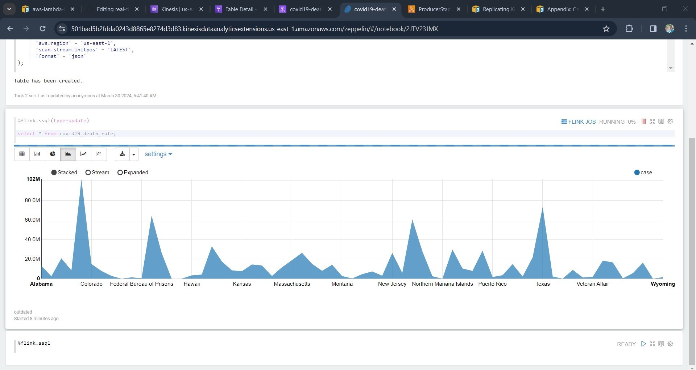

# Real-Time-Covid19 Death rate Tracking Piplines!

The idea of this Project was extracting covid19 data in real time from finnhub api endpoint using aws lambda function as producer to extract the data from the api then produce it to kinesis datastream. then tigger another aws lambda function to consume the data and load to dynamodb. Second process to query the data in real time using real-time kinesis data analytics for apache flink

```
$ python -m venv .venv
```

After the init process completes and the virtualenv is created, you can use the following
step to activate your virtualenv.


Once the virtualenv is activated, you can install the required dependencies.

```
$ pip install -r requirements.txt
```

## Architechure Diagram


## Kinesis Stream data


## Dynamodb  data


## Athena sample query  data


## Apache Flink applications Zeppline query


## Apache Flink applications Zeppline real-time data


## Apache Flink applications Zeppline real-time chart visulization




